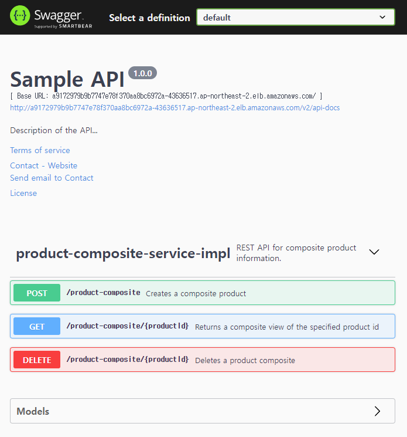

## Chapter 03 : EKS Cluster 에 Monitoring Service 배포하기

**03-01 ECR Sample application 배포하기**

---
## ECR Sample application 배포하기
---
> 당 문서에서는 별도의 CodePipeline 을 구축하지 않고 local PC의 image 를 ECR 에 push 하여 테스트 환경을 구성 한다.<br/>
> commit history 03-01 의 microservice-solution 폴더 복사 후 추가 한다.<br/>
> microservice-solution 은 아래와 같은 구조를 가지는 간단한 샘플 app source code 이다. <br/>
> chapter03에서는 kbuectl 명령어를 이용해 배포 하지만 이후에 CDK 를 이용해 배포하는 방법을 다시 학습한다.


> 프로젝트 루트 폴더에서 microservice-solution 폴더로 이동 해서 docker-compose 를 실행 한다.
```bash
cd microservice-solution
docker-compose up -d
```

> docker images 명령어를 이용해 생성된 application image 를 확인 한다.
```bash
docker images
microservice-solution_review             latest  bf05dfdf5751   8 hours ago    515MB
microservice-solution_product            latest  660f09202e2c   8 hours ago    504MB
microservice-solution_recommendation     latest  51bcf7261360   8 hours ago    504MB
microservice-solution_product-composite  latest  6154386612e9   8 hours ago    501MB
```
> 아래 aws cli 명령어를 입력해서 ECR 저장소 정보를 확인
```bash
aws ecr describe-repositories
{
    "repositories": [
        {
            "repositoryArn": "arn:aws:ecr:ap-northeast-2:<user-no>:repository/cdk-hnb659fds-container-assets-<user-no>-ap-northeast-2",
            "registryId": "<user-no>",
            "repositoryName": "cdk-hnb659fds-container-assets-<user-no>-ap-northeast-2",
            "repositoryUri": "<user-no>.dkr.ecr.ap-northeast-2.amazonaws.com/cdk-hnb659fds-container-assets-<user-no>-ap-northeast-2",
            "createdAt": "2022-05-20T11:22:42+09:00",
            "imageTagMutability": "IMMUTABLE",
            "imageScanningConfiguration": {
                "scanOnPush": true
            },
            "encryptionConfiguration": {
                "encryptionType": "AES256"
            }
        }
    ]
}
```
> chapter01 에서 cdk bootstrap 을 실행 했다면 위와 비슷한 내용이 출력 될 것이다.<br/>
> ECR 정보가 없다면 AWS Management Console 을 통해서 ECR을 먼저 생성한다.<br/>
> ECR 에 업로드 하기 위해서 아래 명령으를 실행 해서 CLI ECR 로그인을 한다. <br/>
> <br/>
> *--password-stdin* 파라미터 값을 위의 출력 내용에서 *repositoryUri*의 domain 값을 붙여 넣어서 실행한다.<br/>
> **주의** 아래 로그인 CLI Login 명령어는 일정 시간이 지나면 유효기간이 만료되므로 Image push 실행 시 인증 오류가 발생하면 아래 명령어를 다시 실행 해야 한다.
```bash
aws ecr get-login-password --region ap-northeast-2 | docker login --username AWS --password-stdin <user-no>.dkr.ecr.ap-northeast-2.amazonaws.com
```
<br/>

> docker iamge id 를 이용해서 *repositoryUrl* + ':tag' 로 image tag 를 생성 한다.
```bash
docker tag <image id> <repositoryUrl>:product-service-0.0.2
```
<br/>

> image tag 가 생성되고 나면 해당 테그를 ECR 로 push 한다.
```bash
docker push <repositoryUrl>:product-service-0.0.1
```
<br/>

> image 를 push 하고 나서 CLI 명령어로 결과를 확인 한다.
```bash
aws ecr list-images --repository-name <repository-name>
{
  "imageIds": [
    {
      "imageDigest": "sha256:4c7fbd66e718acd524565e13f74227881ce6aa232f731df0eb6b722f3c8b6c62",
      "imageTag": "product-service-0.0.2"
    },
  ]
}
```
<br/>

> recommendation, review, product-composite application image 에 대해서도 동일한 작업을 진행 한다.
<br/>

**03-02 microservice deploy**

---
## microservice deploy
--- 
> Chapter02 에서 구축한 EKS Cluster 환경에 DBMS 를 설치하고 Application 을 배포를 진행 한다.<br/>
> commit history 03-02 를 참조하여 *apply/common/product-service-namespace.yml* 파일을 작성<br/>
> commit history 03-02 를 참조하여 <br/>*apply/db/product-mongo.yml*<br/>, *apply/db/product-mysql.yml* 파일을 작성 한다.<br/>
> <br/>
> commit history 03-02 를 참조하여 <br/>*apply/microservice/product-service.yml*<br/>, *apply/microservice/recommendation-service.yml*, *apply/microservice/review.yml*<br/>, *apply/microservice/product-composite-service.yml*<br/> 파일을 작성 한다.
<br/>

> microservice application namespace [product-services]를 먼저 생성 한다.
```bash
kubectl apply -f apply/common
```
> application 실행 전 database 를 먼저 실행한다.<br/>
> *mysql, mongodb 는 docker-hub 에서 가져오기 때문에 ECR push 과정은 불필요하다.*
```bash
kubectl apply -f apply/db
```
> microservice application 을 배포한다.
```bash
kubectl apply -f apply/microservice
```

> 아래 명령어를 입력해 pod 실행 상태를 확인한다.
```bash
kubectl get pods -n product-services
NAME                                        READY   STATUS    RESTARTS   AGE
mongodb-deploy-87c959974-mw2ng              1/1     Running   0          3h9m
mysql-deploy-794f46d844-zhz4l               1/1     Running   0          3h9m
product-composite-deploy-85cd45f5dd-dvjxt   1/1     Running   0          165m
product-deploy-6bcb9dd446-wrmwn             1/1     Running   0          165m
recommendation-deploy-66d5cbf8b6-8d8nz      1/1     Running   0          165m
review-deploy-54f97b56c9-qxrsg              1/1     Running   0          165m
```

> 아래 명령어를 입력해 product-composite 서비스의 임시 domain 주소를 확인한다.
> *임시 Domain 은 LoadBalancer 를 생성 할때마다 변경 되므로 주의*
```
kubectl get svc -n product-services
product-composite   LoadBalancer   xx.xx.xx.xx   xxxx.ap-northeast-2.elb.amazonaws.co
```
> 브라우저에 [임시 Domain + /swagger-ui/index.html] 을 입력해서 application 실행 상태를 확인 한다.
> > 

**03-03 prometheus & grafana helm install**

---
## prometheus & grafana helm install
--- 
> 이제 helm chart 를 이용해 prometheus & grafana 를 클러스터 환경에 구성 해 보자.<br/>
> helm chart 를 이용하면 여러 복잡한 단계를 거쳐야 하는 다수의 pod 구성 및 배포 단계를 패키지 형식으로 간단하게 설치/삭제 할 수 있다.<br/>
> helm install 시작전에 > monitoring namespace 를 먼저 생성한다.
```bash
kubectl create namespace monitoring
```
> helm repository 추가 후 helm repo update
```bash
helm repo add prometheus-community https://prometheus-community.github.io/helm-charts
helm repo update
```
> helm repository 구성이 완료되면 helm chart 에서 사용 할 수 있는 helm cart package 를 확인 할 수 있다.<br/>
```bash
helm search repo | grep prometheus
```
> 본 학습에서는 kubernetes prometheus package 를 설치 하고 설치 pod 상태를 확인 한다.
```bash
helm install prometheus prometheus-community/kube-prometheus-stack --namespace monitoring
kubectl --namespace monitoring get pods
```

> grafana pod id 를 확인해서 포트 연결
```bash
kubectl --namespace monitoring port-forward prometheus-grafana-76d8d4b964-gflg2 3000
Forwarding from 127.0.0.1:3000 -> 3000
Forwarding from [::1]:3000 -> 3000
Handling connection for 3000
Handling connection for 3000
```

> 터미널은 그대로 두고 브라우저에 [http://localhost:3000] 을 입력해 연결 확인 한다.<br/>
> 초기 로그인계정/password는 **admin/prom-operator** 이다<br/>
> 미리 준비된 대시보드를 이용하거나 새로운 대시보드를 추가해서 이것 저것 테스트 해보자<br/>
> microserver-solutaion pod 구성 요소들의 cpu, memory, io 사용량을 확인 할 수 있다.
> 포트 포워드 중단을 월할 경우 터미널에서 ctrl+c 를 입력한다.<br/>
<br/>

> **주의: 테스트 완료후 반드시 아래의 과정으로 모든 리소스를 삭제<br/>
> LoadBalancer service 를 삭제하지 않을 경우 cdk destroy 가 정상적으로 완료되지 않는다**<br/>
```bash
helm uninstall prometheus -n monitoring
kubectl delete -f ./helm/monitoring-namespace.yml
kubectl delete -f ./apply/microservice
kubectl delete -f ./apply/db
kubectl delete -f ./apply/common
cdk destroy
```
