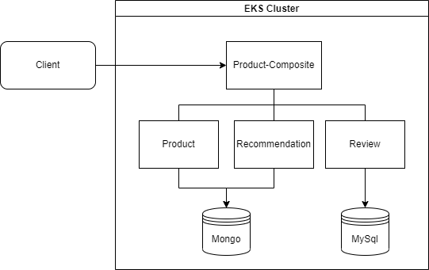

## Chapter 03 : EKS Cluster 에 Monitoring Service 배포하기

**03-01 ECR Sample application 배포하기**

---
## ECR Sample application 배포하기
---
> 당 문서에서는 별도의 CodePipeline 을 구축하지 않고 local PC의 image 를 ECR 에 push 하여 테스트 환경을 구성 한다.<br/>
> commit history 03-01 의 microservice-solution 폴더 복사 후 추가 한다.<br/>
> microservice-solution 은 아래와 같은 구조를 가지는 간단한 샘플 app source code 이다. <br/>



> 프로젝트 루트 폴더에서 microservice-solution 폴더로 이동 해서 docker-compose 를 실행 한다.
```bash
cd microservice-solution
docker-compose up -d
```

> docker images 명령어를 이용해 생성된 application image 를 확인 한다.
```bash
docker images
microservice-solution_review             latest  bf05dfdf5751   8 hours ago    515MB
microservice-solution_product            latest  660f09202e2c   8 hours ago    504MB
microservice-solution_recommendation     latest  51bcf7261360   8 hours ago    504MB
microservice-solution_product-composite  latest  6154386612e9   8 hours ago    501MB
```
> 아래 aws cli 명령어를 입력해서 ECR 저장소 정보를 확인
```bash
aws ecr describe-repositories
{
    "repositories": [
        {
            "repositoryArn": "arn:aws:ecr:ap-northeast-2:<user-no>:repository/cdk-hnb659fds-container-assets-<user-no>-ap-northeast-2",
            "registryId": "<user-no>",
            "repositoryName": "cdk-hnb659fds-container-assets-<user-no>-ap-northeast-2",
            "repositoryUri": "<user-no>.dkr.ecr.ap-northeast-2.amazonaws.com/cdk-hnb659fds-container-assets-<user-no>-ap-northeast-2",
            "createdAt": "2022-05-20T11:22:42+09:00",
            "imageTagMutability": "IMMUTABLE",
            "imageScanningConfiguration": {
                "scanOnPush": true
            },
            "encryptionConfiguration": {
                "encryptionType": "AES256"
            }
        }
    ]
}
```
> chapter01 에서 cdk bootstrap 을 실행 했다면 위와 비슷한 내용이 출력 될 것이다.<br/>
> ECR 정보가 없다면 AWS Management Console 을 통해서 ECR을 먼저 생성한다.<br/>
> ECR 에 업로드 하기 위해서 아래 명령으를 실행 해서 CLI ECR 로그인을 한다. <br/>
> <br/>
> *--password-stdin* 파라미터 값을 위의 출력 내용에서 *repositoryUri*의 domain 값을 붙여 넣어서 실행한다.<br/>
> **주의** 아래 로그인 CLI Login 명령어는 일정 시간이 지나면 유효기간이 만료되므로 Image push 실행 시 인증 오류가 발생하면 아래 명령어를 다시 실행 해야 한다.
```bash
aws ecr get-login-password --region ap-northeast-2 | docker login --username AWS --password-stdin <user-no>.dkr.ecr.ap-northeast-2.amazonaws.com
```
<br/>

> docker iamge id 를 이용해서 *repositoryUrl* + ':tag' 로 image tag 를 생성 한다.
```bash
docker tag <image id> <repositoryUrl>:product-service-0.0.2
```
<br/>

> image tag 가 생성되고 나면 해당 테그를 ECR 로 push 한다.
```bash
docker push <repositoryUrl>:product-service-0.0.1
```
<br/>

> image 를 push 하고 나서 CLI 명령어로 결과를 확인 한다.
```bash
aws ecr list-images --repository-name <repository-name>
{
  "imageIds": [
    {
      "imageDigest": "sha256:4c7fbd66e718acd524565e13f74227881ce6aa232f731df0eb6b722f3c8b6c62",
      "imageTag": "product-service-0.0.2"
    },
  ]
}
```
<br/>

> recommendation, review, product-composite application image 에 대해서도 동일한 작업을 진행 한다.<br/>

 


