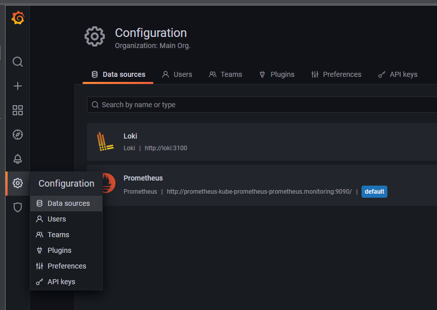
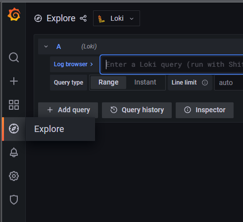

## Chapter 04 : Loki & Fromtail 로 Log Monitoring 구성

**04-01 helm chart 로 loki stack & promtail 설치하기**

---
## helm chart 로 loki stack & promtail 설치하기
---
> 당문서에서는 EKS Cluster 의 pod 로 배포된 Application Log 를 터미널에 접속하지 않고 Grafana Dashboard 로 확인 할 수 있는 환경구축을 목표로 한다.<br/>
> Chapter04 에서 구성한 Sample Application 과 Prometheus & Grafana Monitoring 환경에 loki stack 환경을 추가 해서 진행 할 것이므로 Chapter03 까지의 설치 과정이 진행된 상태에서 실습을 진행 하도록 한다.<br/>
> <br/>
> loki helm chart repository 를 추가 하고 loki stack 이 추가 되었는지 확인 한다.
```bash
helm repo add loki https://grafana.github.io/loki/charts
helm repo update
helm search repo | grep loki
```
> helm 명령어를 이용해 loki 와 promtail 을 cluster 에 배포 한다.
```bash
helm upgrade --install loki --namespace=monitoring loki/loki-stack
```   
> 정상적으로 설치가 되었다면 1개의 loki 서비스와 2개의 promtail pod 설치를 확인 한다.
> *promtail 은 worker node 의 숫자만큼 설치된다.*
```bash
kubectl get svc -n monitoring | grep loki
kubectl get pods -n monitoring | grep promtail
```
> Grafana 화면에서 *Configuration -> datasources* 메뉴로 이동 해서 **loki**  datasource 가 추가 되었는지 확인 하자.<br/>
> > <br/>
>
> **구성요소별 기능**<br/>
> > **loki** : 로그 처리 기능을 담당하는 독립적인 서버 구성 요소
> > - 로그 수집 모듈들을 위한 WEB API Interface 를 제공
> > - 수집된 로그를 Grafana 에게 제공하거나 저장/백업하는 등의 기능 제공
> > <br/>
> >
> > **promtail** : worker node 단위로 설치되어 해당 서버의 로그 파일을 추적, 로그를 수집해서 loki 서버로 전달하는 기능을 담당
> > - loki 가 제공하는 WEB API 를 호출해서 로그 파일 정보를 loki 서버로 전송
> > - 기본적으로 volume mount 된 경로 2개를 추적 가능
> > 1. *docker : /var/lib/docker/containers*
> > 1. *pods : /var/log/pods*
> > - 필요한 경우 volume.yaml 을 구성해서 추가적인 로그 추적 경로 구성 가능
> > - volume.yaml 에 대한 구성은 [여기](https://raw.githubusercontent.com/grafana/loki/master/production/helm/promtail/values.yaml)를 참조 <br/>
> > 이후 학습에서 values.yaml 을 설정하는 다양한 방법을 알아본다.
<br/>

**04-02 loki datasource 로 log dashboard 만들기**

---
## helm chart 로 loki stack & promtail 설치하기
---
> loki data source 를 이용한 log dashboard 를 만들어 보자
> 좌측 메뉴에서 *Explore* 를 선택하고 좌측 상단의 데이터 소스는 *loki* 를 선택 한다.
> > 
> 
> *Log browser* 버튼을 클릭하면 Log query 에서 사용할 수 있는 파라미터 목록이 표시 된다.<br/>
> *1. select labels to search* 항목에서 *filename* 을 선택하고<br/>
> *2. Find values for the slected labels* 항목에서 */var/log/pods/product-services_product-composite~.log* 파일을 선택한 후 *show logs* 버튼을 클릭 한다.<br/>
> chapter03 에서 구성했던 microservice 의 swagger-ui 화면에서 POST 항목의 parameter 에 아래 내용을 붙여넣고 *execute* 버튼을 클릭 하면 로그가 갱신 되는 것을 확인<br/>
```json
{
  "name": "coke",
  "productId": 1,
  "recommendations": [
    {
      "author": "kim",
      "content": "good",
      "rate": 5,
      "recommendationId": 1
    }
  ],
  "reviews": [
    {
      "author": "kim",
      "content": "very good",
      "reviewId": 1,
      "subject": "coke good"
    }
  ],
  "serviceAddresses": {
    "cmp": "",
    "pro": "",
    "rec": "",
    "rev": ""
  },
  "weight": 15
}
```
> 상기 테스트에서 사용한 log file 은 product-composite application 의 로그만 확인 가능하다.<br/>
> 서비스 호출시 하위 서비스 연계 로그까지 조회 하기위해 filename 조건을 변경 해 보자.<br/>
> Log browser 항목의 내용을 아래와 같이 변경 후 [ctrl + enter]<br/>
```json
{filename=~"/var/log/pods/product-services.+"}
```
> 이제 ProductService, RecommendationService, ReviewService 가 모두 조회 되는 것을 확인 가능 하다.<br/>
> **filename 조건에서 [=] 이 아니라 [=~] 로 표현 되는 것에 주목**<br/>
> [=~] 표현식은 정규식으로 로그 조회 조건을 지정하는 것을 의미 한다.<br/>
> 파일명의 끝에 [.+] 로 표현된 것은 와일드 카드 표현식으로 앞자리만 일치하는 모든 파일 내용을 필터링 한다.<br/>
> Log QL 에 대한 자세한 내용은 [여기](https://grafana.com/docs/loki/latest/logql/) 를 참조<br/>
> filename 이 아닌 namespace 를 기준으로 로그를 필터링 하고 대시보드를 추가 해 보자.<br/>
> *2. Find values for the slected labels* 항목에서 *filename* 항목을 한번더 클릭해서 선택 취소하고 *namespace* 를 클릭한후 *product-service*를 선택하고 *show logs* 를 클릭
```json
{namespace="product-services"}
```
> 화면 상단에서 *Add to dashboard* 를 클릭하고 *Open dashboard* 를 클릭 하자.<br/>
> 화면에 표시된 로그 영역이 작다면 리스트의 우측하단 코너를 클릭해서 크기를 조정<br/>
> 저장 버튼을 클릭해서 Dashboard name 을 입력하고 새롭게 만든 product-service-log dashboard 를 저장 하자.<br/>
> 여러가지 로그 조회 조건을 변환해서 테스트 해 보자.<br/>
> 다음에는 조회 조건을 화면상에 선택 항목으로 추가해서 로그를 조회하는 대시보드를 만들어 보자.
