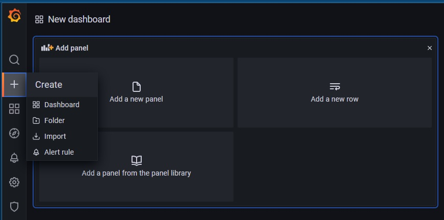
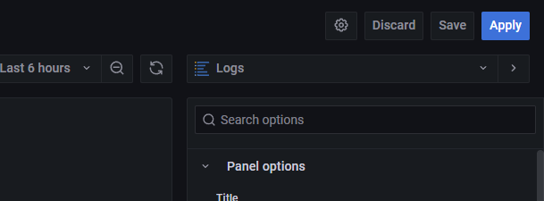
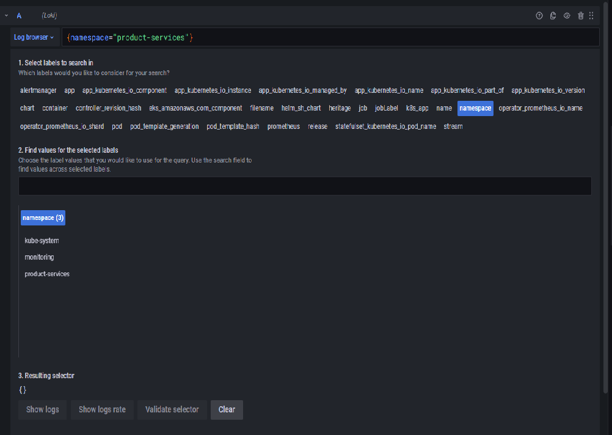
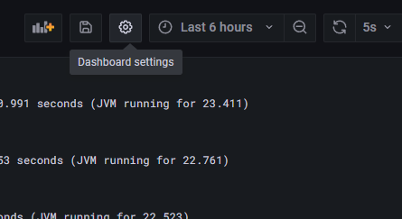
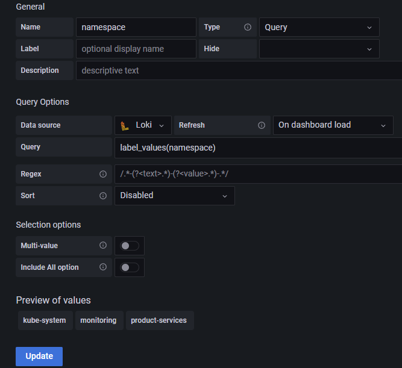
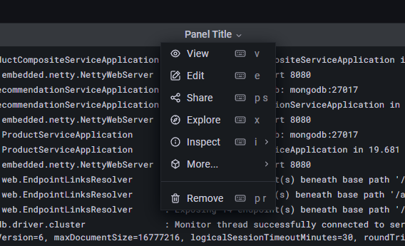

## Chapter 05 : 필터링과 검색이 가능한 대시보드 만들기

**05-01 필터링과 검색이 가능한 대시보드 만들기**

---
## Grafana 에 필터링과 검색이 가능한 대시보드 만들기
---
> Grfana 대시보드는 사용자가 선택하거나 입력 가능한 화면 컴포넌트를 추가하고 변수를 Log QL 에 바인딩해서 화면을 구성 할 수 있는 기능을 제공한다.<br/>
> Namespace 와 app 변수를 추가하고 출력 로그 내에서 특정값을 검색 할 수 있는 대시보드를 만들어보자.
<br/>

> Grafana 우측 메뉴에서 **[+]** 버튼을 누르고 Add a new Panel 을 선택한다.<br>

 <br/>

> 우측의 패널 선택 창에서 Logs 를 선택 한다.<br/>

 <br/>

> 화면 하단의 *datasource* 에서 loki 를 선택하고 *Log browser* 를 클릭한 후 label 에서 *namespace -> product-services* 를 선택하고 하단의 *show logs* 를 클릭한다. <br/>

 <br/>

> 우측의 *Logs* 옵션 항목에서 *Wrap lines* 를 활성화 해주자.<br/>
> 로그 항목이 긴 문자열일 경우 화면상에 표시되지 않기 때문에 줄바꿈으로 표시할 수 있는 꼭 활성화 해야 하는 옵션이다.<br/>
> 이제 우측 상단의 *Apply* 를 클릭하고 패널 크기를 조정하자.<br/>

> 지금은 namespace 의 값이 product-services 로 고정되어 있다.<br/>
> 이제 이 값을 선택할 수 있는 변수로 만들어보자.<br/>
> 화면 우측 상단의 *dashboard settings* 버튼을 클릭하자.<br/>


<br/>

> 왼쪽 메뉴에서 *Variables* 를 선택하고 *Add variable* 버튼을 클릭하자.<br/>
> Variable Edit 화면에서 아래와 같이 값을 입력하고 *Update* 버튼을 클릭하자.

> * General > Name : namespace
> * Query Options > datasource : Loki
> * Query Options > label_values(namespace)


<br/>

> *Preview of values* 항목이 표시되는 것을 확인 했다면 *Save dashboard* 버튼을 클릭하자. <br/>
> dashboard 로 돌아오면 화면 상단에 *namespace* 선택상자가 나타나지만 선택해도 아무런 변화가 없을 것이다.<br/>
> 이제 *namespace* 변수를 Log QL 에 바인딩 해 보자.<br/>
> *Panel Title > Edit* 를 선택해서 패널 쿼리 편집화면으로 들어가자.<br/>



<br/>

> 하단의 Log browser 의 쿼리를 아래와 같이 변경 해서 naemspace 값이 바인딩 되도록 변경 하고 *Apply* 버튼을 클릭한다.<br/>
```json
{namespace="$namespace"}
```
> 이제 namespace 항목을 변경 할때 마다 로그 필터 값이 변경되어 적용되는 것을 확인 할 수 있다.<br/>
> *product-services* 에는 microservice App 와 DB(mongo, mysql) 가 함께 실행되고 있다.<br/>
> DB 를 제외한 App의 로그만 조회 할 수 있도록 설정 해 보자.
> Log Browser 의 label 항목을 확인하면 *app* 가 있는 것을 확인 할 수 있다.<br/>
> app 를 *Variables* 에 추가 해 보자.<br/>
> *dashboard settings* 를 선택하고 **Variables** 메뉴를 선택하면 *namespace* 항목이 보이고 우측 상단에 *New* 버튼이 보인다. *New* 버튼을 클릭하고 아래와 같이 입력하자.
> * General > Name : app
> * Query Options > datasource : Loki
> * Query Options > label_values({namespace="$namespace"}, app)

> *label_values* 에 namespace 항목이 함께 추가되었다.<br/>
> *label_values* 함수는 선택상자의 목록이 파라미터 순서대로 and 조건으로 필터링 될 수 있도록 처리한다.<br/>
> *Save dashboard* 를 클릭해서 대시보드 상태를 저장하고 대시보드 화면으로 다시 돌아가자.<br/>
> 역시나 app 항목을 변경해도 별다른 변경이 나타나지 않는다.<br/>
> *Panel Title > Edit* 를 선택해서 패널 쿼리 편집화면으로 들어가자.<br/>
> Log browser 의 쿼리를 아래와 같이 변경 하고 *Apply* 버튼을 클릭하자.
```json
{namespace="$namespace", app="$app"}
```
> 이제 app 항목을 변경 하면 해당 App 의 로그만 확인 할 수 있다.<br/>

> 필터링이 되기는 하지만 아직 아쉬운 부분이 있다.<br/>
> product-composite 서비스를 호출하게 되면 product, recommendation, review 서비스를 연속적으로 호출해서 처리하도록 되어 있기때문에 4개 app 의 로그를 동시에 확인 할 수 있도록 구성 한다면 좋겠다.<br/>
> 복수 필터링 값을 조정 할 수 있도록 *Variable* 을 변경 해 보자.<br/>
> 화면 우측 상단의 *dashboard settings* 버튼을 클릭하고 *Variables > app* 를 선택하자..<br/>
> 하단의 *Multi-value*, *Include all option* 을 모두 활성화 하고 저장후에 dashboard 로 되돌아 가자.<br/>
> app 항목에 선택 할수 있는 아이템으로 표시된다.<br/>
> product-composite-service, products-service, review-service 등을 복수 선택 한다.<br/>
> 화면상에 로그가 검색되지 않을 것이다.<br/>
> 복수의 조건을 적용하거나 와일드카드를 사용 하려면 Log QL 을 정규식으로 변경해야 한다.<br/>

> *Panel Title > Edit* 를 선택해서 패널 쿼리 편집화면으로 들어가자.<br/>
> Log browser 의 쿼리를 아래와 같이 변경 하고 *Apply* 버튼을 클릭하자.
```json
{namespace="$namespace", app=~"$app"}
```
> **app="$app"** 가 **app=~"$app"** 로 변경된 점에 주목하자.<br/>
> 이제 *Apply* 버튼을 클릭하면 app 에서 선택한대로 로그 항목이 필터링 된 것을 확인 할 수 있다.<br/>

> 로그 항목을 보다 편리하게 찾기위해서 문자열 필터링 기능을 추가 해 보자.<br/>
> *dashboard settings* 를 선택하고 **Variables** 메뉴를 선택하고 *New* 버튼을 클릭하고 아래와 같이 입력하자.<br/>
> * Name: search
> * Type: Text box

> 저장하고 dashboard 로 돌아가자. <br/>
> *Panel Title > Edit* 를 선택해서 패널 쿼리 편집화면으로 들어가자.<br/>
> Log browser 의 쿼리를 아래와 같이 변경 하고 *Apply* 버튼을 클릭한다.
```json
{namespace="$namespace", app=~"$app"} |~ "$search"
```
> *search* 입력창에 DBBUG, INFO, ProductServiceImpl 등 검색 키워드를 입력해서 조회 해보자.<br/>
> 검색 키워드 값이 하이라이트 되어 해당 문자열이 포함된 로그만 확인 가능하다.<br/>
