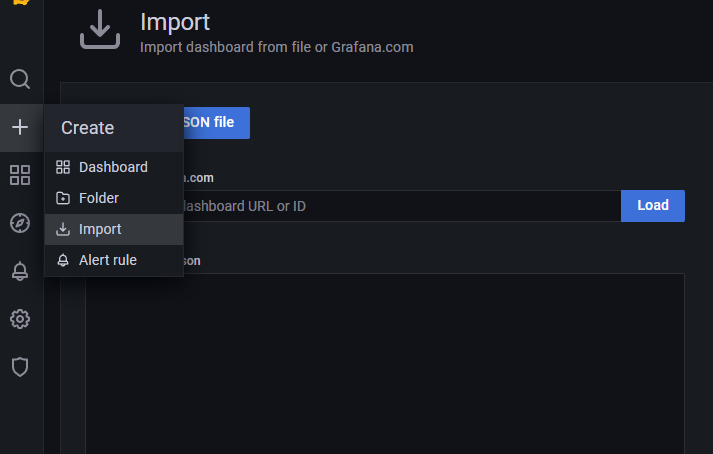

## Chapter 06 : SpringBoot Actuator & Prometheus Monitoring

**06-01 SpringBoot Actuator & Prometheus Configuration**

---
## SpringBoot Actuator & Prometheus 설정
---
> Actuator 는 실행중인 SpringBoot App 의 상태와 내부정보를 확인 할 수 있는 http End point 를 제공한다.<br/>
> starter-actuator 를 Build 의존성에 추가하게 되면 코드 구현 없이 jvm 상태정보를 확인 할 수 있다.<br/>
> registry-prometheus 는 Actuator 에 prometheus metrics end point 를 추가 해 준다.<br/>
> SpringBoot App 에 metrics end point 가 노출되면 prometheus servicemonitor 를 통해서 jvm metrics 정보를 수집 할 수 있게 된다.<br/>

> *microservice-solution/microservices/product-service/build.gradle* 파일 내용을 확인 해 보자. <br/>
> 의존성 정보에서 주목할 내용은 아래의 두 줄이다.<br>
```groovy
  implementation 'org.springframework.boot:spring-boot-starter-actuator'
  implementation 'io.micrometer:micrometer-registry-prometheus'
```
> 위에서 설명한 actuator & prometheus end point 를 노출 하도록 해주는 라이브러리들이다.<br/>
> 의존성 추가 후에는 메트릭 정보를 식별할 수 있게 해 주는 속성을 추가 해 준다.<br/>
*microservice-solution/microservices/product-service/src/main/resources/application.yml*
```yaml
spring:
  application:
    name: product-service
management:
  endpoints:  
    web:
      exposure:
        include: "*"
  metrics:
    tags:
      application: ${spring.application.name}
```
> * **spring.application.name:** spring boot app 를 식별할 수 있는 app name
> * **endpoints.exposure.include:** actuator 로 노출 되는 end point 를 선택 한다. 와일드 [*] 를 사용하면 모든 end point 를 노출하며 *include: "prometheus"* 와 같이 단일 end point 또는 *include: "prometheus", "health"* 와 같이 복수의 선택적 end point 노출이 가능하다. cluster 내부에서 사용되는 Application 이라면 와일드카드를 사용해 전체를 노출하자.
> * **metrics.tags.application:** prometheus metrics 정보에 식별 가능한 테그 정보를 추가 할 수 있다. 기본으로 application 테그를 추가 해 준다.

> 이제 */actuator/prometheus* url 을 이용해 실제 메트릭 정보가 노출되는지 확인 해 보자.<br/>
> Chapter04 까지 진행 되었다면 메트릭 정보를 확인 할 준비가 완료 된 상태이다.<br/>
> poroduct 서비스에서 노출되는 메트릭정보를 눈으로 확인 해 보자.<br/>
```bash
 kubectl port-forward service/product 8081:8080 -n product-services
```
> 서비스 포트를 localhost 로 포워딩 하고 브라우저로 [http://localhost:8081/actuator] 에 접속하자.<br/>
> 현재 사용할 수 있는 end point 정보를 확인 할 수 있다.<br/>
> 브라우저로 [http://localhost:8081/actuator/prometheus] 에 접속하면 메트릭 정보를 확인 할 수 있다.<br/>
> 이제 servicemonitor 를 구성하여 메트릭 정보를 수집하고 Grafana dashboard 에 표시 해 보자.<br/>

<br/>
**06-02 servicemonitor 추가 및 Grafana dashboard 추가**

---
## servicemonitor 추가
---
> helm chart 로 *kube-prometheus-stack* 을 설치 했다면 기본적인 servicemonitor 가 설치된다.
```bash
kubectl get servicemonitor -n monitoring
NAME                                                 AGE
prometheus-grafana                                   3h
prometheus-kube-prometheus-alertmanager              3h
prometheus-kube-prometheus-apiserver                 3h
prometheus-kube-prometheus-coredns                   3h
prometheus-kube-prometheus-kube-controller-manager   3h
...
```
> 여기에 product-service app 서비스 모니터를 추가 하자.<br/>
> commit history 06-02 를 참조 해 *apply/microservice/product-service.yml* 에 서비스 모니터 항목을 추가하자.<br/>
```yaml
---
apiVersion: monitoring.coreos.com/v1
kind: ServiceMonitor
metadata:
  name: product-monitor
  labels:
    app: product-monitor
    release: prometheus
  namespace: monitoring
spec:
  selector:
    matchLabels:
      app: product
  endpoints:
    - interval: 15s
      port: product-svc-port  
      path: "/actuator/prometheus"
      scheme: http
  namespaceSelector:
    matchNames:
      - product-services
```
> * **metatdata.labels.release: prometheus** 는 가장 중요한 항목이다. prometheus metrics 수집기는 "release=prometheus" 조건을 이용해 해당 모니터 정보를 수집하기 때문에다.
> * **sepc.selector.matchLabels.app: product** 수집 대상이되는 서비스의 labels 정보를 기입해서 해당 서비스를 통화하는 메트릭 정보를 수집할 수 있게 해 준다.
> * **endpoints** 는 수집 대상이 되는 서비스의 port 정보를 입력한다.
> * **namespaceSelector** 는 app 와 모니터링 시스템의 namespace 가 다른경우 (보통의 경우 다르다) 반드시 등록 해야 한다.

> 이제 파일을 저장하고 서비스를 지우고 다시 적용하자.
```bash
kubectl delete -f apply/microservice/product-service.yml
kubectl apply -f apply/microservice/product-service.yml
```
> *kubectl get servicemonitor -n monitoring* 명령어로 서비스모니터가등록 되었는지 확인하자.

> 메트릭 정보가 제대로 수집되고 있는지 확인 해보자.
```
kubectl port-forward service/prometheus-kube-prometheus-prometheus 9090:9090 -n monitoring
```
> 포트 포워드 실행 후에 브라우저로 [http://localhost:9090] 에 접속하자.<br/>
> Expression 에 *up == 1* 을 입력하고 *execute* 버튼을 클릭하면 현재 메트릭 수집이 가능한 서비스 목록을 확인 할 수 있다.<br/>
> 메트릭 수집이 된다면 dashboar 도 구성 할 수 있다.<br/>
> Grafana 에서 우측의 [+] 버튼을 클릭하고 import 를 클릭한다.<br/>



> *Load* 버튼 좌측의 입력창에 아래 dashboard ID 를 입력하고 *Load* 버튼을 클릭한다.<br/>
> **12900** <br/>
> 하단의 prometheus 를 선택하고 *import* 를 클릭한다. <br/>
> *SpringBoot APM Dashboard* 를 확인 할 수 있다.<br/>
> 이제 application/pod instance 단위로 cpu, memory, heap/non-heap memory, classes loaded, Threads, GC count, Logback 등의 application 의 내부 상태를 확인 할 수 있다.<br/>
