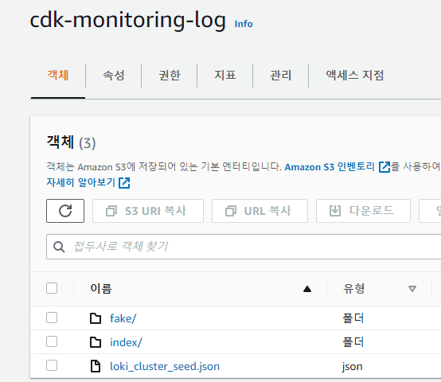

## Chapter 07 : S3 Storage 를 Loki Log 저장소로 사용 하기

**07-01 Loki helm chart values for s3 storage

---
## lok storage 설정
---
> Chapter05 까지 진행 했다면 Application Log 를 Promtail & Loki 를 통해 수집해서 Grafana 를 이용해 로그를 조회하는 구성이 완료 되었을 것이다.<br/>
> 하지만 Node 의 스토리지를 마운트 하지 않았다면 loki pod 가 재시작 되는 순간 그동안 수집된 로그가 모두 삭제 될 것이다.<br/>
> 로그 데이터는 loki pod 내부의 /data 폴더에 저장 되므로 해당 폴더를 EBS, EFS Storage 에 마운트 해 주면 로그정보가 영구 저장 될 수 있다.<br/>
> 단순 파일저장 이외에 ELK, Logstash 등의 Elasticsearch 를 이용한 로그 분석 환경 구성, AWS Cloudwatch 를 이용한 구성 등이 가능하다.<br/>

> 또 하나의 선택사항으로 별도의 설정없이(Driver Install) EBS, EFS 보다 저렴한 S3 Storage 를 영구 저장소로 사용 할 수 있다.<br/>
> S3 Storage 는 Node 에서 구성 가능한 EBS, EFS 보다 성능은 많이 떨어 지지만 저렴하기 때문에 수일 이전의 로그를 실시간으로 조회하는 요구사항이 아니라면 소규모 시스템에서 간단한 구성으로 로그의 영구 저장소로 사용하기에 적합하다.<br/>
> 이번 학습에서는 S3 Storage 를 로그의 영구 저장소로 사용하고 로그 관리를 위한 Loki 설정 값들을 알아본다.<br/>

> **Chapter04 에서 사용하던 loki repository 는 더이상 업데이트 되지 않고 grafana repository 에 통합 되었다.**<br/>
> 먼저 loki reposiotry 를 삭제하고 grafana reposiotry 의 loki helm chart 를 사용 하도록 하자.<br/>
```bash
helm repo remove loki
helm repo add grafana https://grafana.github.io/helm-charts
helm repo update
```
> S3 를 Storage 를 사용하기 위해서는 먼저 S3 Bucket 을 만들자.<br/>
> 본 학습에서는 *cdk-monitoring-log* 라는 bucket 을 만들어서 사용한다.<br/>
> bucket 을 만들때는 보안을 위해 가능한 Bucket 전용 iam 계정을 만들어서 사용하자.<br/>

> bucket 을 만들때 사용한 iam 계정 정보를 cluster 의 secret 환경변수로 추가 해서 loki 의 환경 변수로 사용할 수 있게 준비한다.<br/>
```
kubectl create secret generic iam-loki-s3 --from-literal=AWS_ACCESS_KEY_ID=<aws_access_key_id> \
--from-literal=AWS_SECRET_ACCESS_KEY=<aws_aecret_access_key> -n monitoring
```

> commit history 07-01 *loki/loki-values.yaml* 을 참고하여 파일을 추가한다.
> 해당 파일의 내용중 주요한 내용에 대해서 알아보자.

```yaml
  env:
  - name: AWS_ACCESS_KEY_ID
    valueFrom:
      secretKeyRef:
        name: iam-loki-s3
        key: AWS_ACCESS_KEY_ID
  - name: AWS_SECRET_ACCESS_KEY
    valueFrom:
      secretKeyRef:
        name: iam-loki-s3
        key: AWS_SECRET_ACCESS_KEY
```
> aws s3 bucket 계정 정보를 환경 변수로 만든다.<br/>
> AWS_ACCESS_KEY_ID, AWS_SECRET_ACCESS_KEY 값은 loki config.file 에서 참조하여 사용한다.

```yaml
    ingester:
      chunk_idle_period: 45m
      chunk_block_size: 262144
      chunk_retain_period: 15m
      max_transfer_retries: 0
```
> Log 파일의 storage 갱신 주기를 지정한다.<br/>
> loki 는 로그 내용을 바로 저장하지 않고 cash 영역에 버퍼링 하다가  chunk 영역으로 이동한다.<br/>
> *chunk_idle_period* 는 cash 영역에 데이터를 보관하는 기간이며 시간을 길게 설정 할 수록 cash 영역에 보관하는 시간이 길어진다.<br/>

```yaml
    chunk_store_config:
      max_look_back_period: 168h
    table_manager:
      retention_deletes_enabled: true
      retention_period: 168h
```
> chunk 영역에 저장 하더라도 log 파일을 영구히 보관 할 수는 없다.<br/>
> 위의 2개 설정은 일정 기간 이후의 로그 파일 및 인덱스 정보를 삭제하도록 한다.<br/>
> 168h 는 하루(24h) * 7 을 지정한 것으로 일주일이 지난 로그 정보는 삭제하도록 설정 되었다.<br/>

```yaml
    schema_config:
      configs:
        - from: 2021-05-12
          store: boltdb-shipper
          object_store: s3
          schema: v11
          index:
            prefix: loki_index_
            period: 24h
    storage_config:
      aws:
        s3: s3://ap-northeast-2/cdk-monitoring-log
        s3forcepathstyle: true
        bucketnames: cdk-monitoring-log
        region: ap-northeast-2
        insecure: false
        sse_encryption: false
      boltdb_shipper:
        shared_store: s3
        cache_ttl: 24h
```
> s3 를 log index, file 의 저장소로 사용하도록 하는 설정이다.<br/>
> region 과 bucket 명만 수정하여 적용하도록 한다.<br/>

> 이제 준비가 완료 되었다.<br/>
> chapter04에서 설치되어있던 loki-stack 이 있다면 uninstall 해 주자.<br/>
```bash
helm uninstall loki -n monitoring
```
> 이제 프로젝트 루트에서 grafana/loki-stack 을 설치하자.<br/>
```bash
helm upgrade --install loki grafana/loki-stack -f ./loki/loki-values.yaml --namespace=monitoring --create-namespace
```

> loki 서버의 상태를 로그로 확인 해 보자.<br/>
```bash
kubectl logs -f loki-0 -n monitoring
```

> *uploading tables* 라는 로그가 확인 되면 해당 버킷에 로그정보가 저장되는 것을 확인 할 수 있다.<br/>

> 

