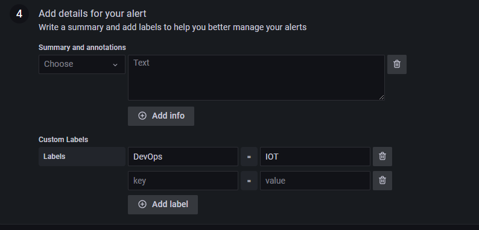

## Chapter 08 : Grafana와 Grafana Alert 훑어보기

*grafana의 기본적인 개념과 Grafana Dashboard Alarm 설정하기*

---
## Data Source
---
> chapter07까지 진행했다면 대략적인 CDK 사용 방법과 Loki 로그 모니터링 방법에 대해 익혔을 것이다.  
> 이번엔 Grafana의 기본적인 개념과 Grafana에서 제공하는 알림 기능에 대해 알아보자.
> 
> 첫 번째로 Grafana가 지원하는 Data Source에 대해 간단하게 정리를 하도록 하겠다. Grafana는 데이터 분석을 실행하기 위한 오픈소스 솔루션으로 방대한 양의 데이터를 활용한 맞춤형 대시보드를 통해 앱을 모니터링 하는 Tool인 만큼, 모니터링을 지원하는 Data Source의 종류도 무척이나 많다. 여기서는 Loki, Prometheus, Cloudwatch 3개만 간단히 설명하도록 하겠다. 
> 
>*https://grafana.com/docs/grafana/latest/datasources/ 에서 Grafana가 지원하는 모든 dataSource에 대해 확인할 수 있다.

__1. Prometheus__
- prometheus는 쿠버네티스 환경에서 가장 대중적으로 사용되는 오픈소스 모니터링 시스템이다. 쿠버네티스 클러스터 및 도커 컨테이너들을 손쉽게 모니터링 가능하다. 시간을 기준으로 수집되어 특정한 수치로 나타나는 메트릭(Metric)을 간단한 텍스트 형식으로 쉽게 노출할 수 있으며, 데이터 모델은 Key-value 형태로 레이블을 집계한 후, Grafana와 연계하여 그래프로 쉽고 간단하게 DashBoard를 만들 수 있다. 또한 이해하기 쉬운 PromQL 쿼리 언어를 사용한다.
  
  *<prometheus를 활용한 서버 모니터링 시스템 구성도* > 

__2. Loki__
- 일반적으로 로그 모니터링은 ELK(ElasticSearch, Logstach, Kibana)가 일반적으로 사용된다. 하지만 ELK는 기능이 많은 만큼, 관리하는 비용도 적지 않다. Loki는 Prometheus에서 영감을 얻은 Grafana에서 제공하는 오픈 소스 중앙 집중식 로그 집계 플랫폼이다. Loki는 로그 내용을 색인화 하지 않고 각 로그 스트림에 대한 레이블만 색인화한다. 이 때문에 Loki는 ELK보다 자원소모가 적고 사용하기가 간편하다. 앞선 실습에서 설치한 Promtail은 Grafana Loki에 인덱싱을 위한 로그 레이블을 보내주는 Loki용 로그 수집기 역할을 한다. 전달받는 로그들을 저장하고, 클라이언트의 LogQL 쿼리를 실행한다. 
  
  *<Grafana, Loki와 Promtail을 이용한 로깅 구성도>*

__3. CloudWatch__
- AWS 리소스와 AWS에서 실행되는 애플리케이션을 실시간으로 모니터링하는 도구다. CloudWatch를 사용하여 리소스 및 애플리케이션에 대해 측정할 수 있는 변수인 지표를 수집하고 추적할 수 있다. Cloudwatch에는 사용중인 모든 AWS 서비스에 관한 지표가 자동으로 표시된다. Grafana와 연계하여 Amazon Elastic Compute Cloud 인스턴스나 컨테이너 같은 AWS 리소스를 추적하는 모니터링 환경을 AWS 콘솔에 로그인하지 않은 채로 구성하고 데이터를 확인할 수 있다.
  
---
## 대시보드(DashBoard)
---
>대시보드는 하나 이상의 패널(panel)로 구성되어 있고 하나 이상의 행으로 배열된다. DataSource와 그에 따른 Query로 정의해 원하는 데이터를 추출해주는 패널들을 배치해서 구성 가능하다.  
매트릭 정보를 직접 집계하여 사용하거나, 필요한 데이터를 정의하는 게 번거로운 작업이기 때문에 Grafana 홈페이지(https://grafana.com/grafana/dashboards)에서 다른 사용자들이 구성해놓은 대시보드 포맷을 import하여 손쉽게 대시보드를 구현할 수 있다.

__1.패널(Panel)__
- 대시보드를 구성하는 하나의 단위이자 Grafana의 기본 시각화 구성 요소. 각 패널에는 패널에서 선택한 DataSource에 대한 쿼리 편집기가 있다. 쿼리 편집기를 사용하면 패널에 표시하는 데이터의 Visualiztion을 추출할 수 있다. Grafana는 각 패널에는 다양한 종류의 스타일링/ 포맷 옵션을 제공한다. 
  *<grafana에서 제공하는 다양한 Visualization*> 

__2.Parameter - variable__
>패널을 위한 metric 값을  필요한 파라미터를 variable(변수)이라고 한다. 이 Query와 Variable은 Data Source별로 차이가 있다. 이 중에서 간단하게 CloudWatch의 variable Setting하는 방법에 대해 알아보자.
대시보드에 패널 추가를 하고 DataSource를 CloudWatch로 설정하면 NameSpace, MetricName, Statistic 변수를 설정할 수 있다. NameSpace에서는 AWS 어플리케이션들의 서비스가 그룹화되어 있다. 즉, AWS/EC2,  AWS/Fsx, AWS/AutoScailing등이 select Box에 나타나며 이를 선택할 수 있다. Metric Name은 해당하는 Namespace에서 지원하는 Metric 정보를 선택할 수 있으며, Statistic에서는 보고싶은 Metric 정보의 수치를 (평균값, 최소값 등) 설정한다.

위의 그림은 AWS EC2 Instances들의 CPU 사용률 최대값 Metric 정보를 보고 싶을 때 셋팅하는 방법이다. Dimensions에서 InstanceId를 셋팅하면 해당 Instance의 정보만 볼 수 있다.

  * Loki - loki에서 사용하는 LogQL과 관련 내용은 https://grafana.com/docs/loki/latest/logql/ 에서 자세하게 확인할 수 있다.
  * Prometheus - Prometheus에서 사용하는 promQL 관련 내용은 https://prometheus.io/docs/prometheus/latest/querying/basics/에서 자세하게 확인할 수 있다.

---
## 알림(Alert)
---
> Alert 기능은 Grafana 모니터링에서 중요한 요소다.  모니터링 하는 인스턴스들의 임계치를 설정하여 이를 Contact Point로 받아 Grafana를 계속 모니터링 하지 않고도 인스턴스의 상태를 관리할 수 있기 때문이다.   Grafana에서 알람 규칙은 Dashboard의 구성요소 (Query)를 이용해 구성 가능할 수 있으며, Microsoft Teams, Slack, Telegram 등 다양한 Contact Point를 제공하고 있다. 

1. __알림 규칙__ 
+ 알림 인스턴스를 실행할지의 여부를 결정하는 평가 기준. 하나 이상의 쿼리 및 식, 조건, 확인 빈도 및 선택적으로 조건이 충족되는 Period로 구성된다. 또한 Grafana에서 관리 알림은 다차원 알림을 지원한다. 알림 규칙이 생성되면 다양한 상태 (Alert, Pending, normal) 및 전환을 거친다.
  >
  Grafana managed Alert으로 Rule Type, Alert이 저장될 폴더를 설정하면 자동으로 하단에 Alert을 설정하는 2번 항목들이 셋팅된다. A에서는 DataSource별로 가져올 매트릭 혹은 로그 항목을 설정할 수 있으며 B에서는 A에서 가져온 항목으로 임계치를 설정한다.  3번 Define alert Conditions에서 이 B를 가지고 어떤 Period동안 데이터를 지켜본 후 Alert을 보낼 지 설정할 수 있다. 또한 알림 규칙별로 추가 Description, label을  설정해줄 수도 있다. 이때 이 label은 알림 정책 및 Silence에서 매칭되며, 심각도 별로 알림을 그룹화하는 데 사용할 수도 있다. 

2. __Contact point__
* 알림을 받을 때 연락처가 통지되는 방법을 정의한다.    Grafana에서는 다양한 ChatOps 도구를 지원하여 알림이 제 시간에 전달되도록 한다. 지원하는 ContactPoint의 종류로는 기본적으로 Email이 있으며, Slack, Microsoft Teams, Telegram등이 있다.    
  >
Contact point type를 선택하면, 그에 따른 설정 값들이 아래에 보이게 된다. 예를 들어 Email 항목의 경우 수신할 Address를 설정할 수 있으며, ';'로 구분하여 Address를 여러개 입력할 수 있다. 

3. __알림 정책__
* 어떤 알림 규칙에 어떤 contact Point를 셋팅할 지를 정할 수 있다. label Matcher에 따라 어떤 알람 규칙이 어떤 Contact Point들에 연결될 지를 정한다.  
  label Matcher의 경우 label, value, operator의 3가지 부분으로 나뉘어 있다. label은 일치시킬 라벨 이름이며, 정확히 일치해야 한다. value 필드는 label에 해당하는 값이며, operator에 따라 달라진다.  연산자는 label 값에 대해 일치시킬 연산자이며, 사용 가능한 연산자는 다음과 같다.

  * = value와 정확히 동일한 label
  * != value와 일치하지 않는 label    
  * =~ value 값과 일치하는 label (해당 value을 포함하는 label)
  * !~ value와 일치하지 않는 label (해당 value를 포함하지 않는 label)

1. __Silence__
* 설정한 기간 별로 알림 규칙을 무시하는 규칙. 정한 Period 내에서 설정한 label Matcher 조건에 적합한 알림 규칙에 적합해도 알림을 생성하지 않는다. 설정한 Period가 지나면 다시 알림이 시작된다. Silence는 사용자 인터페이스에 알림이 표시되는 것이나, 알림 규칙을 평가하는 것을 막지 않고 단지 알람이 생성되어 Contact Point로 보내는 것만을 중단시킨다.

5. __알람 그룹__
 *  알람 그룹은 alert Admin Instance의 그룹화된 경보를 표시한다. 기본적으로 알림은 통지 정책에서 루트 정책의 label key별로 그룹화된다. 공통 경고를 단일 alert group으로 그룹화하면 중복 경고가 발생하는 것을 방지할 수 있다.

### 실제로 알람 규칙을 만들고 알람 정책에 연결해보자. ###

  

  >
  위의 variable에서 단계에서 확인해봤던 EC2 CPU 사용량 최대값 Metric 정보를 가지고 알림 규칙을 만들어보자.
    >
    A에서 설정한 Metric 정보 중에서 가장 최신 CPU 사용량 최대값이 12를 넘을 경우를  B에서 임계치로 설정하고, 3번에서 이 B의 상태를 1m동안 확인하는데 5분동안 해당 상태가 유지될 경우에 Alert을 보내도록 한다.
    >
    privew Alert으로 알림 상태를 확인할 수 있고, Label 입력 시 이를 'DevOps = IOT'로 그룹화하여 관리할 수 있다.

    * 위에서 만든 Alert Rule을 Contact Point에 연결해보자.
  >
  >이런식으로 설정을 하면 label이 DevOps = IOT인 항목들이 Alert Rule에 적합할 경우 Telegram으로 Alert을 보내주게 된다.